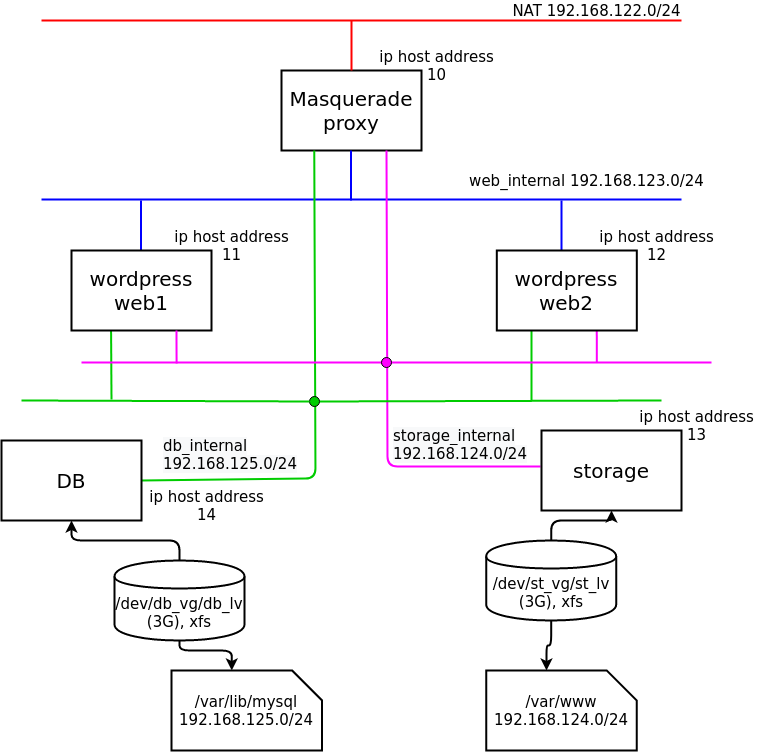

# 리눅스 서비스 구성 가이드 및 아키텍쳐
## Services
- Storage Service
  - Repo: [NFS,SMB,iSCSI](storage)
## Architectures
- IP Masquerading in 3 tier architecture
  - Repo: [IP Masquerading](ip-masquerade)
  
- Pacemaker
  - Repo: [Pacemaker](pacemaker)